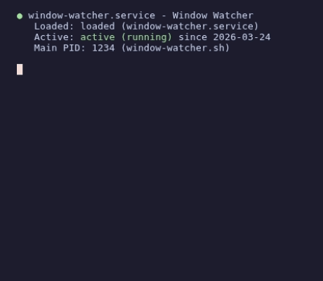

# window-watcher

Reactive X11 window watcher that moves new windows to the workspace where they were launched from. Zero CPU usage when idle — listens to `xprop` events instead of polling.

<p align="center">
  
</p>

## How it works

A background tracker monitors window focus changes and records which workspace the user is on. When a new window appears from a watched application, `window-watcher` moves it to the workspace the user was on before the new window appeared. It also handles existing windows that get activated from another workspace (e.g., opening a file that activates a browser on a different workspace).

This handles apps that reuse a single process or are spawned by other processes — regardless of how the window was created, it lands on the right workspace.

A companion tool `ww-open` is included as a workspace-aware replacement for `xdg-open`. It opens files/URLs in a browser window on your current workspace — if no browser exists there, it launches a new window instead of adding a tab to a browser on another workspace.

The `DISPLAY` variable is auto-detected at runtime, so the service works regardless of which display number your X11 session uses (`:0`, `:1`, etc.).

## Requirements

- X11 session (works with XWayland on Ubuntu 22.04/24.04)
- `wmctrl`
- `xprop` (from `x11-utils`)
- `systemd` (user service)

## Installation

Install dependencies with your package manager:

```bash
# Debian/Ubuntu
sudo apt-get install wmctrl x11-utils

# Fedora
sudo dnf install wmctrl xprop

# Arch
sudo pacman -S wmctrl xorg-xprop
```

Then run the installer:

```bash
bash install.sh
```

This will:
1. Copy `window-watcher.sh` and `ww-open` to `~/.local/bin/`
2. Enable and start a systemd user service

## ww-open

Workspace-aware replacement for `xdg-open`. Use it to open files or URLs in a browser on your current workspace:

```bash
ww-open dashboard.html
ww-open https://example.com
```

If a browser window already exists on your workspace, it opens a new tab there. If not, it launches a new browser window on the current workspace.

## Uninstallation

```bash
bash uninstall.sh
```

## Configuration

Edit `WATCH_CLASSES` in `~/.local/bin/window-watcher.sh` to add or remove watched applications:

```bash
WATCH_CLASSES=("chromium" "chrome" "google-chrome" "firefox" "slack")
```

To find the `WM_CLASS` of any window:

```bash
xprop | grep WM_CLASS
# then click on the window
```

## Debugging

Enable verbose logging:

```bash
systemctl --user set-environment DEBUG=1
systemctl --user restart window-watcher
journalctl --user -u window-watcher -f
```

## Useful commands

```bash
# View logs
journalctl --user -u window-watcher -f

# Stop the service
systemctl --user stop window-watcher

# Restart the service
systemctl --user restart window-watcher

# Check status
systemctl --user status window-watcher
```

## License

[MIT](LICENSE)
